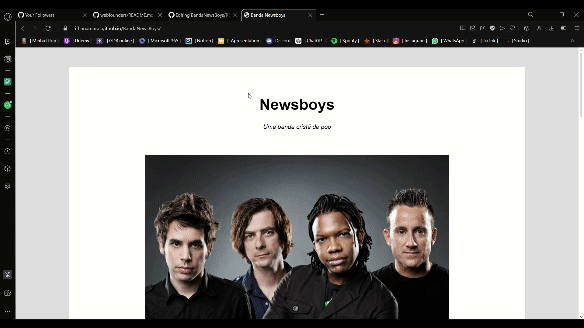

# Banda News Boys
Link do projeto --->  https://ithanamaral.github.io/BandaNewsBoys/
 
 
## Descrição
Site que fiz como proposta de um blog informativo sobre a banda americana The News Boys. Foi desenvolvido com Html e Css para treino e composição de portifólio !
 
 

## GIF's
Aqui estão alguns gifs do site desse projeto, para ver o video completo vá na pasta projectClips! =)
 

 
 

## About Me
Olá, meu nome é Íthan !

Esse é um dos vários projetos que tenho no meu GitHub. Eles são feitos para estudo e para montar meu portfólio de vagas na área de desenvolvimento (sendo este, voltado para Front-End). Pode ser um projeto simples, mas estou muito feliz por te-lô feito.
